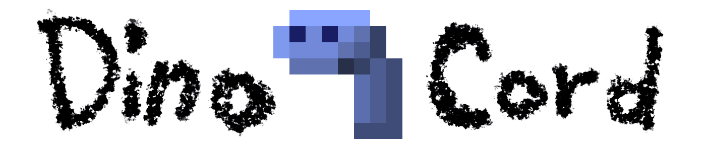

# Project Status - Not Being Developed
This repo was a small hobby project at the start of 2020 to investigate the
workings of Discord's API; dinocord is not being actively developed.
Please look to, and give your support to, a module that being actively developed:
- Discordeno https://github.com/discordeno/discordeno

## About
A small hobby project to try and make a Discord API library for deno.

## Creating your first bot.
```js
import { createClient } from 'https://deno.land/x/dinocord/mod.ts';

const client = await createClient('token');

console.log('Bot Connected:', client);

for await (const ctx of client) {
  if (ctx.event === 'MESSAGE_CREATE') {
    await ctx.reply(`***Roar!*** ${ctx.author} said:\n>>> ${ctx.text}`);
  }
}
```

###### Est. 20th Jan 2020
